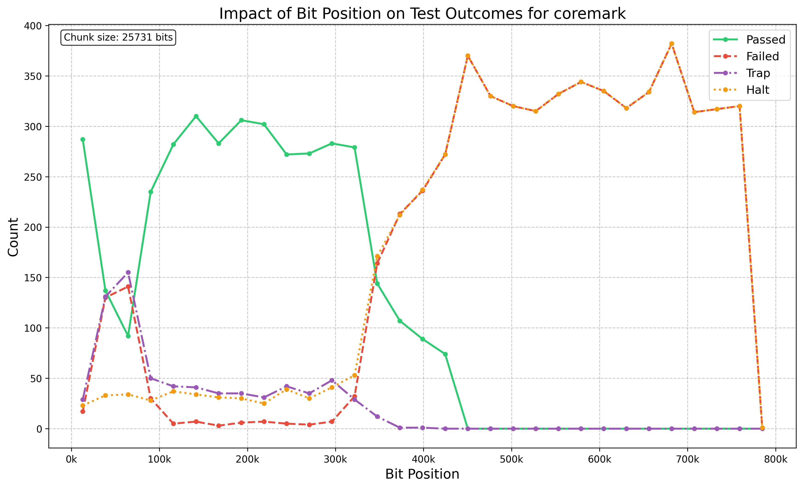
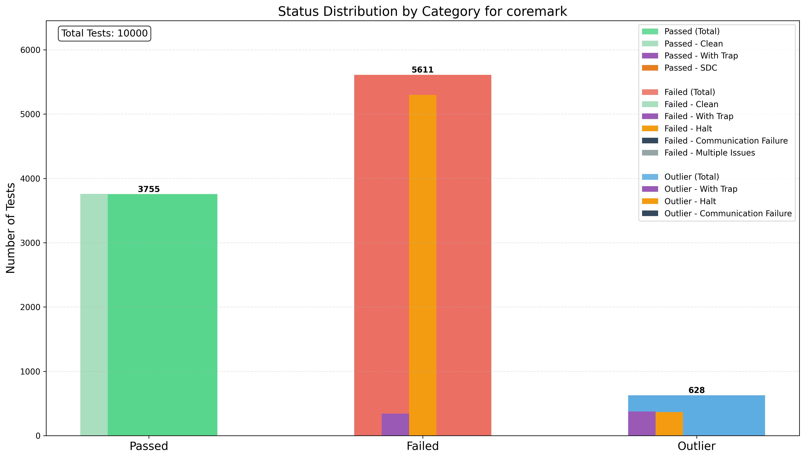
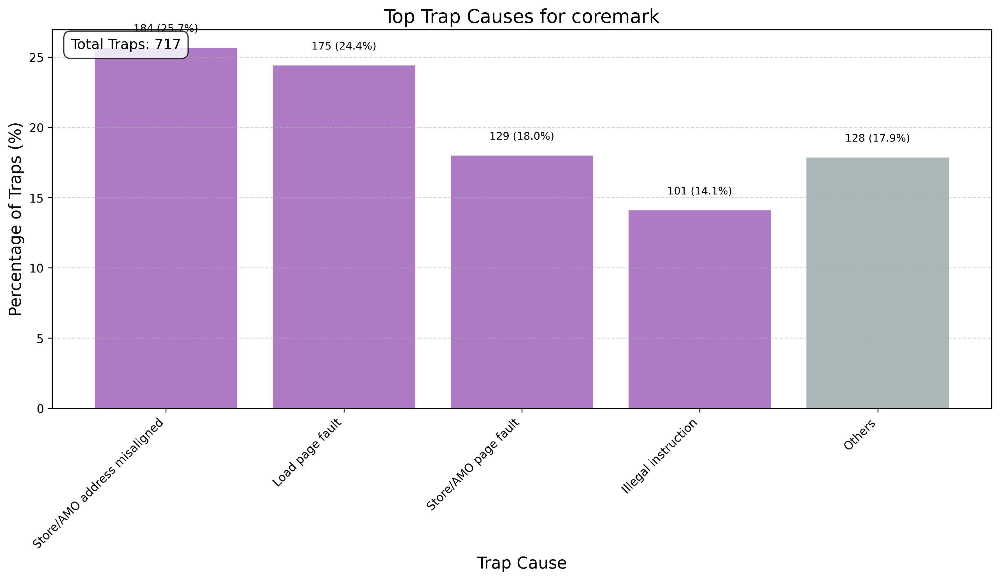

# RAPID: Reliability Analysis and Precision Injection Diagnostic

RAPID helps analyze the reliability of software by:

- Injecting faults into program binaries
- Monitoring execution logs
- Parsing and classifying execution results
- Converting results to SQL databases for analysis
- Visualizing failure patterns and statistics

RAPID has been developed to analyze the reliability of operating systems and embedded software, but it can be adapted to other software types.

## Installation

pip install git+https://github.com/tollsimy/rapid.git

## Quick Start

```bash
# Full pipeline example
python -m rapid --full-pipeline --log-dir logs/ --inject-dir inject/ --db fault_analysis.db --log-format my_log_format.py --classifier-dir classifiers/
```

## Usage

### 1. Fault Injection

Inject bit-flips or other faults into binary files:

```bash
python -m rapid --inject --binary-file program --num-flips 10 --output-dir inject/
```

### 2. Parsing Test Logs

Parse test output logs using the provided log format and provided classifiers for each custom benchmark type:

```bash
# Parse single file
python -m rapid --parse-logs --log-file output.log --inject-file inject/coremark_bitflips.json --log-format my_log_format.py --classifier my_classifier.py

# Parse multiple files
python -m rapid --parse-logs --log-dir logs/ --inject-dir inject/ --log-format my_log_format.py --classifier my_classifier.py
```

### 3. Importing Results to Database

Convert parsed results to an SQLite database:

```bash
python -m rapid --import-results --results-dir results/ --db fault_analysis.db
```

### 4. Analyzing Results

Analyze fault injection results and automatically generate visualizations:

```bash
# Analyze all benchmarks with default visualizations
python -m rapid --analyze --db fault_analysis.db --all-benchmarks

# Analyze specific benchmark with visualizations saved to custom directory
python -m rapid --analyze --db fault_analysis.db --benchmark coremark --output-dir ./figures/

# Skip visualization generation
python -m rapid --analyze --db fault_analysis.db --benchmark coremark --skip-plots

# Generate text-only analysis (no visualizations)
python -m rapid --analyze --db fault_analysis.db --benchmark coremark --text-only

# Create combined visualizations across multiple benchmarks
python -m rapid --analyze --db fault_analysis.db --all-benchmarks --combined
```

The analysis process automatically generates several visualization types:

- Status distribution bar charts showing passed/failed/outlier results
- Bit position impact line charts showing how bit positions affect outcomes
- Trap cause frequency charts (individual and comparison across benchmarks)

All visualizations are saved as PNG images in the specified output directory (default: plots).

To compare results across multiple benchmarks, use the `--combined` flag with `--all-benchmarks`.

Example output:

```
===========================================================================
RAPID: Reliability Analysis and Precision Injection Diagnostic
===========================================================================


============================================================
Analyzing benchmark: coremark
============================================================
+-------------+------------------+----------+---------------------+----------------+
| Total Tests | Classified Tests | Coverage | Manual Check Needed | Missing Status |
+-------------+------------------+----------+---------------------+----------------+
| 10000       | 9994             | 99.94%   | 6 (0.06%)           | 0 (0.00%)      |
+-------------+------------------+----------+---------------------+----------------+
+----------------------+------------+------------+
| Category             | Raw Count  | Percentage |
+----------------------+------------+------------+
| total_tests          | 10000      | 100.00%    |
| passed               | 3755       | 37.55%     |
| failed               | 5611       | 56.11%     |
| outlier              | 628        | 6.28%      |
| needs_manual_check   | 6          | 0.06%      |
| -------------------- | ---------- | ---------- |
| with_trap            | 717        | 7.17%      |
| halt                 | 5662       | 56.62%     |
| comm_failure         | 1          | 0.01%      |
| SDC                  | 0          | 0.00%      |
| exec_failure         | 4          | 0.04%      |
| hw_reset             | 0          | 0.00%      |
| -------------------- | ---------- | ---------- |
| clean_pass           | 3753       | 37.53%     |
| clean_fail           | 0          | 0.00%      |
| clean_outlier        | 252        | 2.52%      |
| missing_status       | 0          | 0.00%      |
+----------------------+------------+------------+

Note: event counts may exceed total tests due to multiple events per test.
      (e.g., a test that has both a trap and an SDC would be counted in both columns)

+----------------+------+------+--------------+-----+--------------+----------+-------+---------+----------------+
| Status/Event   | trap | halt | comm_failure | SDC | exec_failure | hw_reset | Clean | Row Sum | Database Total |
+----------------+------+------+--------------+-----+--------------+----------+-------+---------+----------------+
| passed         | 1    | 0    | 1            | 0   | 0            | 0        | 3753  | 3755    | 3755           |
| failed         | 341  | 5297 | 0            | 0   | 4            | 0        | 0     | 5642    | 5611           |
| outlier        | 375  | 365  | 0            | 0   | 0            | 0        | 252   | 992     | 628            |
| missing status | N/A  | N/A  | N/A          | N/A | N/A          | N/A      | N/A   | N/A     | 0              |
| manual check   | N/A  | N/A  | N/A          | N/A | N/A          | N/A      | N/A   | N/A     | 6              |
| Column Total   | 717  | 5662 | 1            | 0   | 4            | 0        | 4005  | 10389   | 10000          |
+----------------+------+------+--------------+-----+--------------+----------+-------+---------+----------------+

Note: Row sums may exceed database totals due to tests with multiple events.
      (e.g., a test that has both a trap and an SDC would be counted in both columns)

==== OVERLAPPING EVENTS ANALYSIS ====
+----------+----------------+---------------+------------+-------------------+----------------+
| Category | Database Total | Sum of Events | Difference | Overlapping Tests | Overlap Match? |
+----------+----------------+---------------+------------+-------------------+----------------+
| passed   | 3755           | 3755          | 0          | 0                 | ✓              |
| failed   | 5611           | 5642          | 31         | 31                | ✓              |
| outlier  | 628            | 992           | 364        | 364               | ✓              |
+----------+----------------+---------------+------------+-------------------+----------------+

Note: If the difference between 'Sum of Events' and 'Database Total' matches 'Overlapping Tests',
      then it confirms the consistency of the counts (allowing for ±1 rounding errors).

==== COMPARING TO HIERARCHY COUNTS ====
+--------------+-----------+-----------------+--------+
| Category     | Raw Count | Hierarchy Count | Match? |
+--------------+-----------+-----------------+--------+
| passed.total | 3755      | 3755            | ✓      |
| passed.clean | 3753      | 3753            | ✓      |
| passed.trap  | 1         | 1               | ✓      |
| passed.halt  | 0         | 0               | ✓      |
| failed.total | 5611      | 5611            | ✓      |
| failed.clean | 0         | 0               | ✓      |
| failed.trap  | 341       | 341             | ✓      |
| failed.halt  | 5297      | 5297            | ✓      |
+--------------+-----------+-----------------+--------+

Strict Failures Breakdown:
+-----------+-------+--------+--------------+-------+--------------+--------+---------------+--------+
| Benchmark | trap  | halt   | comm failure | SDC   | exec failure | others | uncategorized | Total  |
+-----------+-------+--------+--------------+-------+--------------+--------+---------------+--------+
| coremark  | 3.22% | 52.67% | 0.01%        | 0.00% | 0.04%        | 6.47%  | 0.06%         | 62.47% |
| counts    | 322   | 5267   | 1            | 0     | 4            | 647    | 6             | 6247   |
+-----------+-------+--------+--------------+-------+--------------+--------+---------------+--------+

Note: Strict failures are tests that have reported events. A passed test with an event is considered a failure. An outlier is always a failed test.

Note: Main categories contain tests with EXACTLY that issue and no other events.
      'Others' includes tests with multiple events or no specific event.
      'Uncategorized' contains tests that need manual verification.
      Multiple events: 395, No specific events: 252, Manual check needed: 6

Trap Causes Breakdown:
+------------------------------+-------+------------+
| Trap Cause                   | Count | % of Traps |
+------------------------------+-------+------------+
| Store/AMO address misaligned | 184   | 25.66%     |
| Load page fault              | 175   | 24.41%     |
| Store/AMO page fault         | 129   | 17.99%     |
| Illegal instruction          | 101   | 14.09%     |
| Reserved (0x4)               | 74    | 10.32%     |
| Instruction page fault       | 54    | 7.53%      |
| TOTAL TRAPS                  | 717   | 100.00%    |
+------------------------------+-------+------------+

Generating visualizations...
Bit position impact chart saved to plots/coremark_bit_position_impact.png
Status hierarchy bar chart saved to plots/coremark_status_bars.png

Analysis complete!
```





### 5. File Monitoring

Monitor a file for changes and receive alerts when it stops updating:

```bash
# Monitor a log file with alerts when stuck for 30 seconds
python -m rapid --monitor --file output.log --alert-interval 30

# Monitor with custom sound alert
python -m rapid --monitor --file output.log --sound-file /path/to/sound.wav
```

Example usage: UART logs from a target device can be monitored for communication failures or device hangs.

## Custom Log Format Files

You must create a custom log format Python file to parse test logs. This file defines patterns for extracting information from logs:

```python
# Example my_log_format.py

# Pattern to extract test numbers from the log (required)
# Example: "Running test coremark_1" -> "coremark", "1"
TEST_NUMBER_PATTERN = r'_([0-9A-Za-z]+)(?:\s+(.*))?'

# Marker indicating the start of a new test block (required)
TEST_BLOCK_MARKER = "Running test"

# Format for generating test names (required)
# {benchmark_type} and {test_num} are placeholders that will be replaced
TEST_NAME_FORMAT = "{benchmark_type}_{test_num}"

# Pattern for extracting benchmark type from the path (required)
# Example: "inject/coremark/coremark_1" -> "coremark"
BENCHMARK_PATTERN = r'benchmark/([a-zA-Z0-9_]+)/([a-zA-Z0-9_]+)_(\d+)'
```

You can use `my_log_format.py` as a template to create your own log format file.

## Custom Classifiers

You can create custom classifiers to identify test outcomes from log files. This file must implement the `BenchmarkClassifierInterface` class.

You can use `my_classifier.py` as a template to create your own classifier.

## Command-Line Options

### Main Commands

- `--monitor`: Monitor a file for changes
- `--inject`: Inject faults into a binary
- `--parse-logs`: Parse test output logs
- `--import-results`: Import results to a database
- `--analyze`: Analyze results in the database
- `--full-pipeline`: Run parse, import, and analyze in sequence

### Common Options

- `--log-file`: Path to a single log file
- `--log-dir`: Directory containing log files
- `--inject-file`: Path to a single injection specification file
- `--inject-dir`: Directory containing injection files
- `--results-dir`: Directory to save results
- `--db`: Path to the SQLite database
- `--log-format`: Path to custom log format file (required for parsing)
- `--classifier`: Path to custom classifier file
- `--classifier-dir`: Directory containing custom classifiers

## Troubleshooting

### Common Issues

1. **"No suitable classifier found"**: Make sure you've included a custom classifier that matches your benchmark type.

2. **"Error loading log format file"**: Check that your log format file contains all required variables.